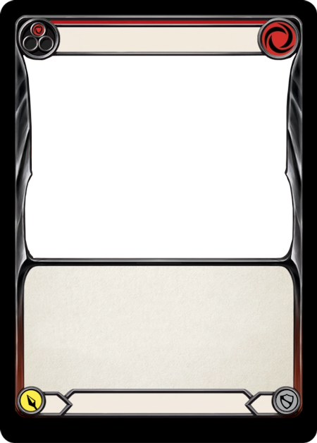
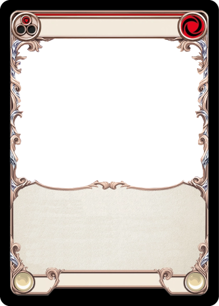
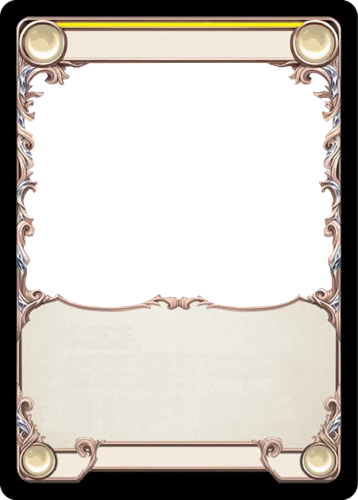
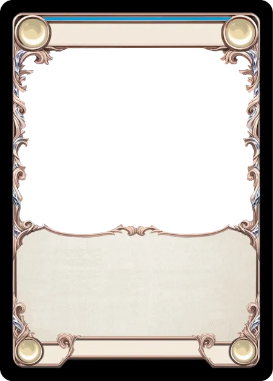
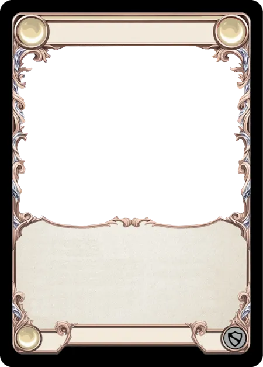

# CatroSlot
Modifies a base image by inserting others in the corners and generates all possible variants. Based on the Card Game Flesh And Blood
To see more about the game visit: https://fabtcg.com/


## Index
1. [How to use](#how-to-use)  
2. [Naming](#naming)  
3. [Requirements](#requirements)  
4. [Run it](#run-it)  
5. [Executing](#executing)  
6. [Example of results](#example-of-results)

# How to use

To execute the program you should include before an image in a "base" folder.
ALL CARDS SHOULD BE IN THE SAME EDITION (new or old)

**VERY IMPORTANT**: The base image would generate exactly 96 cards of outputs.

## Naming

the image should be a card with a format "{talent}\_{class}\_{action}_{color}.png"
where:
- talent: is the talent of the card e.g: "draconic", "Ice", "lighting" etc...
- class: is the class of the card e.g: "warrior", "illusionist", "brute" etc...
- action: is the action of the card e.g: "attack", "non-attack" etc....
- color: is the color of the card, the color should be in a number e.g: "red" = 1, "yellow" = 2 or "blue" = 3

The talent could be none if the card has no talent, example:

Has a card name ice_warrior_attack_2.png
that symbolizes an ice talent warrior attack card with yellow color

but the card name warrior_attack_2.png
that symbolizes a warrior attack card with yellow color and no talent

The class, action and color should be always present

---

## Requirements

You need to have python installed in your computer, you can download it from https://www.python.org/downloads/
and you should install also uv for more informateion see [this](https://docs.astral.sh/uv/getting-started/installation/#installation-methods)

Then you can install the requirements in two ways:

1. Using the uv:

```bash
uv sync
```

2. Using the script to run it:

The script have a line to auto-install if the .venv folder is not present

```bash
bash run.sh
```

---

## Run it
You can run the program using the corresponding run file.

run.sh for bash and run.pw1 for PowerShell, that last one
is windows only

```bash
bash run.sh
```

if it is more confortable for you you can run the python file directly
but firstly you need to load the .venv using:

```bash
source .venv/bin/activate
```

then you can run the program using:

```bash
python main.py
```

to deactivate the .venv just use:

```bash
deactivate
```

aditionally you can make the run file executable using:

```bash
chmod +x run.sh
```

## Executing

After using the run file or the python file directly you will see a certain amount of questions

the first question is about if your cards are old or new, the default option is that are new
edition. The diferences between both are the size of the symbol e.g:

new edition:




old edition:



---

Then the program ask you if you want to generate all the combinations in a specific format.
The format accepted are: 

- BLP  
- BMP  
- DIB  
- BUFR  
- CUR  
- PCX  
- DCX  
- DDS  
- EPS  
- FITS  
- FLI  
- FTEX  
- GBR  
- GIF  
- GRIB  
- HDF5  
- PNG  
- JPEG2000  
- ICNS  
- ICO  
- IM  
- IPTC  
- JPEG  
- MPEG  
- TIFF  
- MPO  
- MSP  
- PALM  
- PCD  
- PDF  
- PIXAR  
- PPM  
- PSD  
- QOI  
- SGI  
- SUN  
- TGA  
- WEBP  
- WMF  
- XBM  
- XPM 

# Example of results

Here you can see some examples of the results.

The base image is this one:


And some of the outputs are the next:

<table>
  <tr>
    <td align="center">
      <br>
    </td>
    <td align="center">
      <br>
    </td>
    <td align="center">
      <br>
    </td>
  </tr>
</table>
